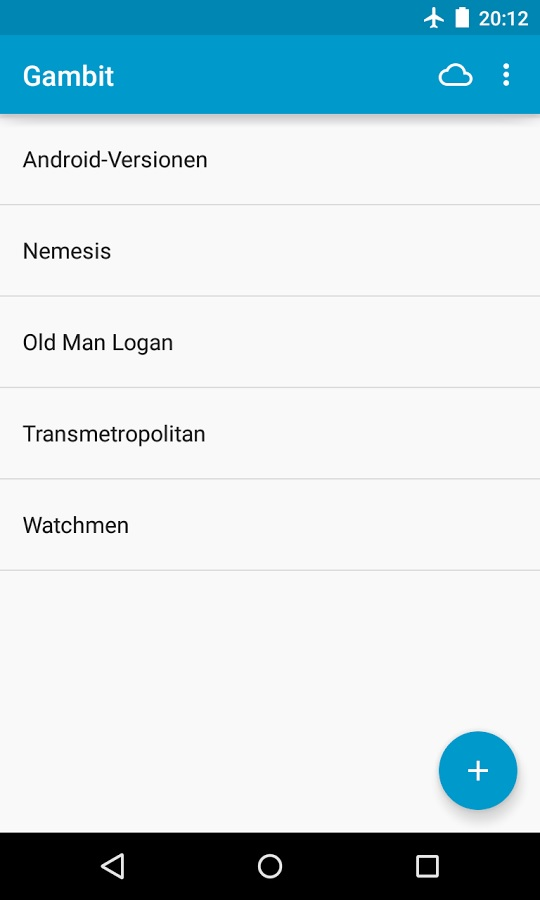
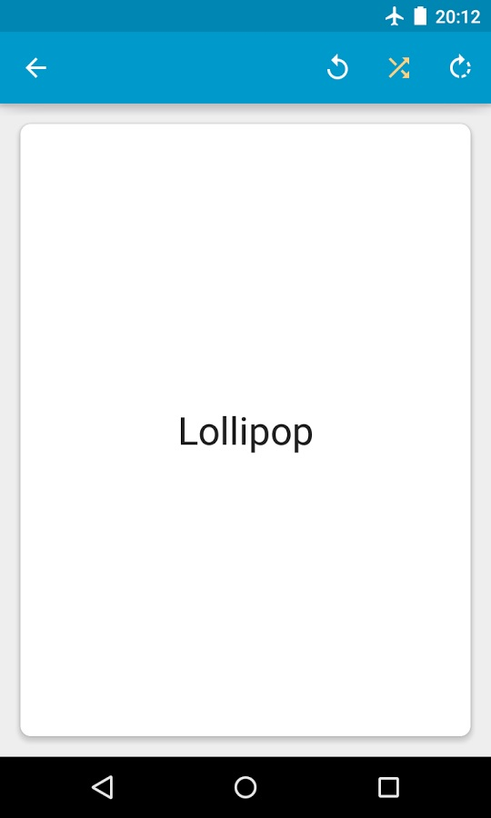

# Stuffly to Gambit Converter

Stuffly Folders to [Gambit Flashcards](https://play.google.com/store/apps/details?id=ru.ming13.gambit) converter.

## About
*Stuffly to Gambit Converter* convertes Stuffly Folders to an SQLite database compatible with [Gambit Flashcards](https://play.google.com/store/apps/details?id=ru.ming13.gambit) version 1.2.0. Each Stuffly File will be converted to a Gambit Deck.

Each line in the Stuffly File will be converted to a single Card within the deck.

## Usage
If the *Stuffly to gambit Converter* is registered in your PATH system variable just run it within your Stuffly Folder:

    c:\Path\To\My\Stuffly\Folder\StufflyToGambitConverter.exe

Otherwise, run the converter out of its folder and provide the Stuffly Folder as the first and only command line parameter:

    c:\StufflyToGambitConverter\StufflyToGambitConverter.exe "c:\Path\To\My\Stuffly\Folder"

**NOTE: The path to the Stuffly Folder must not end with backspace.**

The converter will create the file called *Output.db* that can be imported into [Gambit Flashcards](https://play.google.com/store/apps/details?id=ru.ming13.gambit).

## Known Limitations
Current version is 0.1.0 and thus very limited in functionality. Here are the main known limitations:

- The Stuffly Folder must not contain two or more Stuffly Files with the same name.
- All the Stuffly Files within the Stuffly Folder will be converted. It is not possible to convert specific Stuffly Files or to exclude certain files.
- There is no logging or error handling. If anything goes wrong, the application will simply crash.

## License

*Stuffly to gambit Converter* is licensed under the [MIT license](LICENSE.txt).